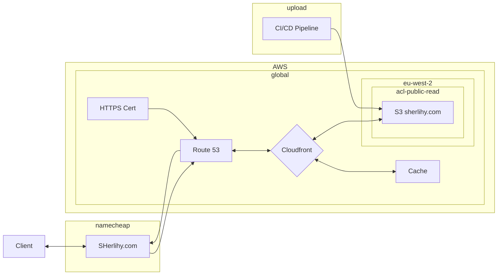

# sherlihy.com

## Description

A web application with AI chatbot that you can use to find out more about me experience and expertise.

## Motivation

I created sherlihy.com after reflecting on the work I had done for i2Group, making complex front-end features, and finding I wanted to go beyond creating features and experience delivering web applications. I chose a portfolio website as I also wanted to experience creating and maintaining a web application with an indefinate lifecycle.

## Usage

1. Visit [sherlihy.com](https://sherlihy.com)
2. Chat with the AI Chatbot
3. Click the menu in the top left to explore more
4. Use my contact details in the banner to contact me

## Infrastructure Diagram

---
