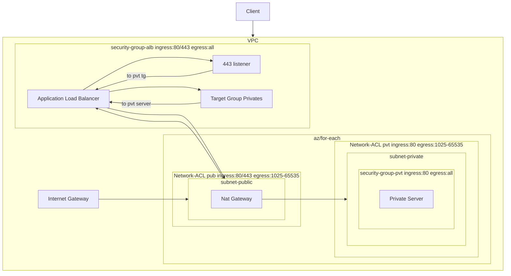

```mermaid
flowchart TD
    cli[Client]
    ig[Internet Gateway]

    cli-->VPC

    subgraph VPC

        subgraph security-group-alb ingress:80/443 egress:all
            alb[Application Load Balancer]
            httpsListner[443 listener]
            pvtsTG[Target Group Privates]
        end

        alb-->httpsListner
        httpsListner-->|to pvt tg|alb
        
        alb-->pvtsTG
        pvtsTG-->|to pvt server|alb

        subnet-public-->alb

        ig-->subnet-public

        alb-->subnet-public

        subgraph az/for-each
            
            subgraph Network-ACL pub ingress:80/443 egress:1025-65535
                subgraph subnet-public
                    nat[Nat Gateway]
                end
            end

            nat-->subnet-private

            subgraph Network-ACL pvt ingress:80 egress:1025-65535
                subgraph subnet-private
                    subgraph security-group-pvt ingress:80 egress:all
                        pvt[Private Server]
                    end
                end
            end
        end
    end
```
