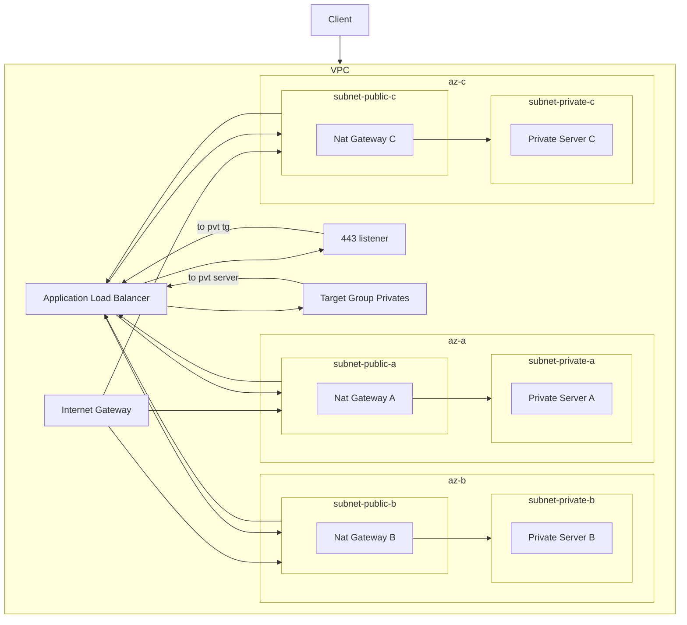

```mermaid
flowchart TD
    cli[Client]
    ig[Internet Gateway]

    cli-->VPC

    subgraph VPC

        alb[Application Load Balancer]
        httpsListner[443 listener]
        pvtsTG[Target Group Privates]

        alb-->httpsListner
        httpsListner-->|to pvt tg|alb
        
        alb-->pvtsTG
        pvtsTG-->|to pvt server|alb

        subnet-public-a-->alb
        subnet-public-b-->alb
        subnet-public-c-->alb

        ig-->subnet-public-a
        ig-->subnet-public-b
        ig-->subnet-public-c

        alb-->subnet-public-a
        alb-->subnet-public-b
        alb-->subnet-public-c

        subgraph az-a
            
            subgraph subnet-public-a
                natA[Nat Gateway A]
            end

            natA-->subnet-private-a

            subgraph subnet-private-a
                pvtA[Private Server A]
            end
        end
        
        subgraph az-b
            
            subgraph subnet-public-b
                natB[Nat Gateway B]
            end
            
            natB-->subnet-private-b

            subgraph subnet-private-b
                pvtB[Private Server B]
            end
        end

        subgraph az-c
            
            subgraph subnet-public-c
                natC[Nat Gateway C]
            end
            
            natC-->subnet-private-c

            subgraph subnet-private-c
                pvtC[Private Server C]
            end
        end
    end
```
