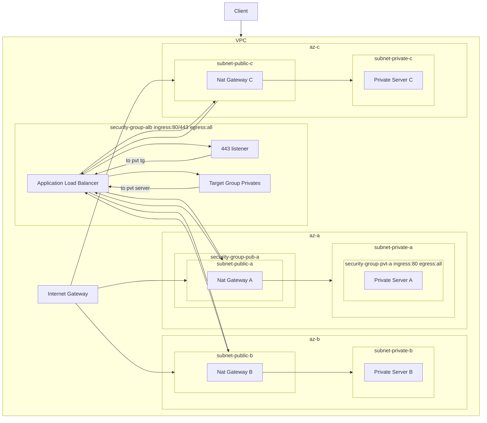

```mermaid
flowchart TD
    cli[Client]
    ig[Internet Gateway]

    cli-->VPC

    subgraph VPC

        subgraph security-group-alb ingress:80/443 egress:all
            alb[Application Load Balancer]
            httpsListner[443 listener]
            pvtsTG[Target Group Privates]
        end

        alb-->httpsListner
        httpsListner-->|to pvt tg|alb
        
        alb-->pvtsTG
        pvtsTG-->|to pvt server|alb

        subnet-public-a-->alb
        subnet-public-b-->alb
        subnet-public-c-->alb

        ig-->subnet-public-a
        ig-->subnet-public-b
        ig-->subnet-public-c

        alb-->subnet-public-a
        alb-->subnet-public-b
        alb-->subnet-public-c

        subgraph az-a
            
            subgraph security-group-pub-a
                subgraph subnet-public-a
                    natA[Nat Gateway A]
                end
            end

            natA-->subnet-private-a

            subgraph subnet-private-a
                subgraph security-group-pvt-a ingress:80 egress:all
                    pvtA[Private Server A]
                end
            end
        end
        
        subgraph az-b
            
            subgraph subnet-public-b
                natB[Nat Gateway B]
            end
            
            natB-->subnet-private-b

            subgraph subnet-private-b
                pvtB[Private Server B]
            end
        end

        subgraph az-c
            
            subgraph subnet-public-c
                natC[Nat Gateway C]
            end
            
            natC-->subnet-private-c

            subgraph subnet-private-c
                pvtC[Private Server C]
            end
        end
    end
```
