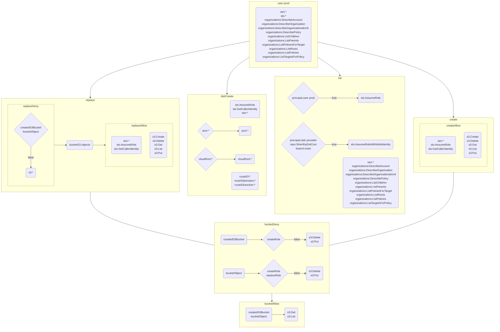

```mermaid
            flowchart TB
subgraph prod [user prod]
    prodEnable("`
        iam:*
        sts:*
        organizations:DescribeAccount
        organizations:DescribeOrganization
        organizations:DescribeOrganizationalUnit
        organizations:DescribePolicy
        organizations:ListChildren
        organizations:ListParents
        organizations:ListPoliciesForTarget
        organizations:ListRoots
        organizations:ListPolicies
        organizations:ListTargetsForPolicy
    `")
end

prod --> init
prod --> create
prod --> replace
prod --> distCreate

subgraph replace [replace]
    subgraph replaceDeny
    replaceDenyRes{"`
        createdS3Bucket
        bucketObject
    `"}
    
    replaceDenyRes -- false --> replaceDenyDeny
    
    replaceDenyDeny("`
        s3:*
    `")
    
    end
    
    replaceDeny --> replaceRes
    
    replaceRes("`
        bucketS3 objects
    `")
    
    replaceRes --> replaceAllow
    
        subgraph replaceAllow
        replaceEnable("`
            iam:*
            sts:AssumeRole
            sts:GetCallerIdentity
        `")
        replaceReplace("`
            s3:Create
            s3:Delete
            s3:Get
            s3:List
            s3:Put
        `")
    end
end

replace --- bucketDeny

subgraph init [init]
     initProdCon{"`
         principal:user prod
     `"}
     
     initProdCon -- true --> initProdAllow
     
     initProdAllow("`
         sts:AssumeRole
     `")
     

     initCon{"`
         principal:oidc-provider
         repo:SHerlihyDotCom
         branch:main
     `"}
     
     initCon -- true --> initActionsAllow

     initActionsAllow("`
         sts:AssumeRoleWithWebIdentity
     `")

     initAllow("`
         iam:*
         organizations:DescribeAccount
         organizations:DescribeOrganization
         organizations:DescribeOrganizationalUnit
         organizations:DescribePolicy
         organizations:ListChildren
         organizations:ListParents
         organizations:ListPoliciesForTarget
         organizations:ListRoots
         organizations:ListPolicies
         organizations:ListTargetsForPolicy
     `")
 end

subgraph distCreate
    dcaEnable("`
        sts:AssumeRole
        sts:GetCallerIdentity
        iam:*
    `")

    dcaACMRes{"`
        acm:*
    `"}
    
    dcaACMRes --> dcaACMAllow
    
    dcaACMAllow("`
        acm:*
    `")

    dcCDNRes{"`
        cloudfront:*
    `"}
    
    dcCDNRes --> dcCDNAllow
    
    dcCDNAllow("`
        cloudfront:*
    `")

    dcR53Allow("`
        route53:*
        route53domains:*
        route53resolver:*
    `")

end

subgraph create [create]
    subgraph createAllow
    createEnable("`
        iam:*
        sts:AssumeRole
        sts:GetCallerIdentity
    `")
    createCreate("`
        s3:Create
        s3:Delete
        s3:Get
        s3:List
        s3:Put
    `")
    end
end

create --- bucketDeny

subgraph bucketDeny
bucketDenyCond{"`
    createRole
`"}

bucketDenyRes --> bucketDenyCond
bucketDenyCond -- false --x bucketDenyDeny

bucketDenyDeny("`
        s3:Delete
        s3:Put
`")

bucketDenyRes("`
    createdS3Bucket
`")

objDenyCond{"`
    createRole
    replaceRole
`"}

objDenyRes --> objDenyCond
objDenyCond -- false --x objDenyDeny

objDenyDeny("`
        s3:Delete
        s3:Put
`")

objDenyRes("`
    bucketObject
`")
end

bucketDeny --> bucketAllow

subgraph bucketAllow
bucketAllowRes("`
    createdS3Bucket
    bucketObject
`")

bucketAllowRes --> bucketAllowAllow

bucketAllowAllow("`
    s3:Get
    s3:List
`")
end


```
