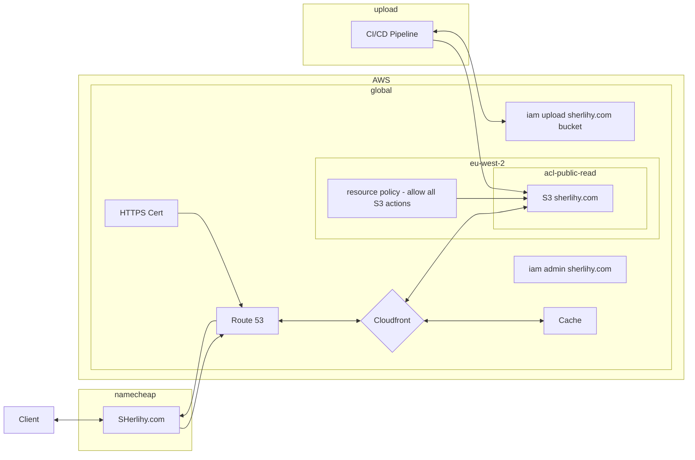

```mermaid
            flowchart LR
                Client <--> Site
                
                subgraph namecheap
                    Site[SHerlihy.com]
                end

                Site --> R53
                R53 --> Site

                subgraph AWS
                subgraph global
                    Uploader[iam upload sherlihy.com bucket]
                    Admin[iam admin sherlihy.com]
                    DNS{Cloudfront}
                    R53[Route 53]
                    Cert[HTTPS Cert]
                    
                    Cert --> R53
                    R53 <--> DNS
                    DNS <--> Cache
                    DNS <--> S3
                    
                    subgraph eu-west-2
                    S3AllActions[resource policy - allow all S3 actions]
                    S3AllActions --> S3

                        subgraph acl-public-read
                            S3[S3 sherlihy.com]
                        end
                    end
                end
                end

                subgraph upload
                Actions[CI/CD Pipeline]
                Actions --> S3
                Actions <--> Uploader
                end
```
