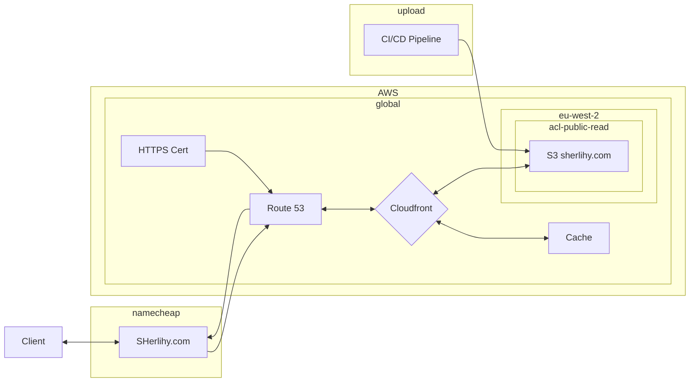

# Description

## Overview

## Diagram

```mermaid

    flowchart LR

    Client <--> Site
    
    subgraph namecheap
        Site[SHerlihy.com]
    end
    
    Site --> R53
    R53 --> Site

    subgraph AWS
    subgraph global
        DNS{Cloudfront}
        R53[Route 53]
        Cert[HTTPS Cert]
        
        Cert --> R53
        R53 <--> DNS
        DNS <--> Cache
        DNS <--> S3
        
        subgraph eu-west-2
            subgraph acl-public-read
                S3[S3 sherlihy.com]
            end
        end
    end
    end
    
    subgraph upload
    Actions[CI/CD Pipeline]
    Actions --> S3
    end


```
